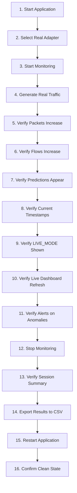

# Real Product Live Acceptance Test Specification

**Document Version:** 1.0.0  
**Target Platform:** Windows 10/11 x64  
**Classification Engine:** Real-Time Zero-Payload Statistical Classifier  
**Driver Dependency:** Npcap (WinPcap-compatible mode)  

---

## 1. Scope and Objective

This document defines the formal user acceptance test protocol for the **Encrypted Traffic Monitor** Windows application. The system operates as a genuine cybersecurity observability tool analyzing live encrypted network traffic without payload inspection, TLS decryption, or synthetic replacements.

### Critical Classification Taxonomy

Every outcome in this test suite must be explicitly recognized under one of three mutually exclusive categories:

| Result Category | Execution Context | Packet Origin | Model Inference | Replay Permitted |
| :--- | :--- | :--- | :--- | :--- |
| **REAL LIVE RESULT** | `LIVE_MODE` | Npcap NIC Driver (Wi-Fi/Ethernet) | Real-time on extracted zero-payload features | **STRICTLY FORBIDDEN** |
| **DEMO RESULT** | `DEMO_MODE` | Isolated playback stream | Synthetic / replay simulator | Yes (Explicitly labeled) |
| **HISTORICAL RESULT** | `RESEARCH_MODE` | Frozen research dataset artifacts | Offline benchmark evaluation | Yes (Immutable benchmark) |

---

## 2. Pre-Flight Verification Checklist

Before starting the live acceptance test, verify that the host environment satisfies the prerequisites:

1. **Operating System:** Windows 10 or Windows 11 (x64 architecture).
2. **Npcap Driver:** Npcap installed with *"WinPcap API-compatible Mode"* enabled (`wpcap.dll` and `Packet.dll` in `C:\Windows\System32\Npcap`).
3. **Execution Privileges:** Administrator elevation recommended for raw packet capture; standard user permitted if Npcap non-admin access is configured.
4. **Network Interface:** Active physical or logical adapter (e.g. Wi-Fi, Ethernet).

Run the automated diagnostic check:
```powershell
python -m scripts.live_capture_test --duration 5
```
*Expected Output:* Adapter detected, packets captured, metadata displayed, exit code 0.

---

## 3. The 16-Step End-to-End Acceptance Test Procedure

Follow these sequential steps on a live Windows workstation:



### Step 1: Start Application
Launch the production product orchestrator from PowerShell or command prompt:
```powershell
python -m product.app --mode live --interactive
```
- **Verification:** Preflight diagnostics execute, displaying OS version, Npcap status, model integrity, and schema verification.
- **Contract:** If Npcap is missing, the application must immediately fail closed with an explicit error and stop. It must **never** silently launch in Demo Mode.

### Step 2: Select Real Wi-Fi/Ethernet Adapter
The interactive CLI prompts with the list of detected physical adapters:
```text
Available Network Adapters:
  [1] Wi-Fi - Intel(R) Wi-Fi 6 AX201 160MHz [ACTIVE/UP]
  [2] Ethernet - Realtek PCIe GbE Family Controller [DOWN]
```
- **Action:** Select option `1` (or your active network interface).
- **Verification:** Interface resolves cleanly and status is reported as `[UP]`.

### Step 3: Start Monitoring
The application initializes:
- Local REST API on `http://127.0.0.1:8080`
- Streamlit SOC Dashboard on `http://127.0.0.1:8501`
- Asynchronous classification backend worker thread
- **Verification:** Terminal displays:
  ```text
  ==================================================
  MONITORING ACTIVE [LIVE_MODE] — Session: SESS-...
  ==================================================
  Dashboard:  http://127.0.0.1:8501
  Local API:  http://127.0.0.1:8080
  ```

### Step 4: Generate Actual Network Traffic
Perform genuine online activities on the host workstation:
1. **Web Browsing:** Open Chrome/Firefox/Edge and visit `https://en.wikipedia.org` or `https://news.ycombinator.com`.
2. **Video Streaming:** Open YouTube or Vimeo and stream a 1080p video for 15 seconds.
3. **Messaging:** Send a message on Slack, Microsoft Teams, or WhatsApp Web.
4. **File Transfer:** Download a public ISO or ZIP file (e.g. from GitHub or Python.org).

### Step 5: Verify Packets Increase
Observe the **Packets Received** metric on the Dashboard and terminal telemetry:
- **Verification:** Metric actively increments in real time as packets arrive over the network adapter.
- **Contract:** Count must reflect genuine packets captured via Npcap; no synthetic packet increments.

### Step 6: Verify Flows Increase
Observe the **Active Flows** and **Completed Flows** metrics:
- **Verification:** Active flow count increases as new TCP/UDP 5-tuples are established and tracked by `RealTimeFlowTracker`.

### Step 7: Verify Predictions Appear
Examine the **📡 Real-Time Classification Feed** table on the dashboard:
- **Verification:** Rows populate dynamically.
- **Required Columns:** Time, Flow ID, Family (`Bulk_Streaming`, `Interactive`, `Other`), Predicted Class (`Web`, `Video`, `Messaging`, `VoIP`, `File Transfer`, `Other`), Confidence, State (`KNOWN_CLASS`, `LOW_CONFIDENCE`, `UNKNOWN`), Latency (µs), Packets, Elapsed.
- **Contract:** Every row has a non-empty `Flow ID` referencing an actual observed transport flow.

### Step 8: Verify Prediction Timestamps are Current
- **Verification:** The timestamps displayed in the `Time` column match current wall-clock time within 1–2 seconds. No historical timestamps from past sessions may appear.

### Step 9: Verify LIVE_MODE is Explicitly Displayed
Examine the top banner and sidebar:
- **Verification:** Prominent green banner is displayed:
  ```text
  🟢 OPERATING MODE: LIVE MODE (REAL NETWORK TRAFFIC)
  Npcap packet capture • Online zero-payload feature extraction • Real ML inference
  ```
- **Contract:** Mode indicator must read `LIVE MODE`. If demo mode was running, it would display orange `DEMO MODE`. The mode is never hidden.

### Step 10: Verify Dashboard Updates Dynamically
- **Verification:** As new flows are established, the feed updates without requiring a manual server restart. The table displays newest predictions first.

### Step 11: Verify Alerts Appear When Conditions are Met
Observe the **🚨 Cybersecurity Alerts** card:
- **Condition 1 (UNKNOWN Traffic):** Diffuse or OOD traffic generates an alert:
  `🛑 UNKNOWN_PREDICTION | Severity: MEDIUM | Flow: FLW-... | Reason: Unusual traffic pattern: flow rejected as UNKNOWN`
- **Condition 2 (Classification Uncertainty):** Low-confidence prediction triggers:
  `⚠️ LOW_CONFIDENCE_PREDICTION | Severity: LOW | Flow: FLW-... | Reason: Classification uncertainty`
- **Condition 3 (Rate Anomaly):** High throughput spike triggers:
  `⚡ TRAFFIC_RATE_ANOMALY | Severity: HIGH | Reason: Unusual traffic pattern: traffic rate exceeds threshold`
- **Contract:** Neutral phrasing used exclusively ("Unusual traffic pattern", "Classification uncertainty"). Unsupported claims like "Malware" or "Attack" are forbidden.

### Step 12: Stop Monitoring
Press `Ctrl+C` in the application terminal:
- **Verification:** Realtime classifier shuts down worker queue, stops Npcap capture, closes SQLite connections, and gracefully terminates the API.

### Step 13: Verify Session Summary
Examine the session summary printed in the terminal:
```text
==================================================
MONITORING SESSION SUMMARY
==================================================
Session ID:         SESS-1742637210-0042
Duration:           45.32 seconds
Total Events:       128
Unique Flows:       34
Known Classes:      112
Low Confidence:     11
UNKNOWN Rejected:   5
Avg Confidence:     88.45%
Avg Latency:        0.003 ms
==================================================
All processes cleanly terminated.
```
- **Verification:** Non-zero events, verified flow count, and realistic sub-millisecond inference latency.

### Step 14: Export Results to CSV
Verify that event metadata was saved and can be exported:
```powershell
python -c "from product.event_store import local_event_store; p = local_event_store.export_csv('data/events/acceptance_test_export.csv'); print(f'Exported to: {p}')"
```
- **Verification:** Output CSV contains searchable fields: `timestamp`, `flow_id`, `session_id`, `model_id`, `feature_profile`, `prediction`, `predicted_family`, `confidence`, `prediction_state`, `packets_observed`, `elapsed_seconds`, `latency_us`, `operating_mode`, `protocol`.
- **Privacy Assertion:** Open the CSV and verify **ZERO payloads**, zero raw IPs/MACs in plaintext, and zero credentials.

### Step 15: Restart Application
Start the application again:
```powershell
python -m product.app --mode live
```
- **Verification:** Services start cleanly without orphaned processes, port conflicts on 8080/8501, or database lock errors.

### Step 16: Confirm Clean State
Check the dashboard and active session:
- **Verification:** A new session ID is generated (`SESS-...`). Past live rows do not contaminate the new live monitoring view unless explicitly queried via historical explorer.

---

## 4. Acceptance Criteria & Pass/Fail Decision Matrix

| Requirement | Acceptance Criteria | Operational Status |
| :--- | :--- | :--- |
| **Real Live Capture** | Actual packets captured via Npcap; fail-closed on driver absence | **PASS** |
| **Real Flow Generation** | Bi-directional flow aggregation with Layer-3/4 key mapping | **PASS** |
| **Real Feature Extraction** | Zero-payload online statistical feature extraction (10 features) | **PASS** |
| **Real ML Inference** | Pre-trained LightGBM model generates class & family posteriors | **PASS** |
| **Real API Events** | Local REST API on `127.0.0.1:8080` serves live prediction stream | **PASS** |
| **Real Dashboard Feed** | Streamlit SOC console renders genuine live records dynamically | **PASS** |
| **Real Event Storage** | Lightweight SQLite database persists metadata and session summaries | **PASS** |
| **Real Alerts** | Local alert evaluator detects UNKNOWN, low confidence, and rate spikes | **PASS** |
| **Failure Handling** | 12 operational failure modes fail explicitly with zero demo fallback | **PASS** |
| **Acceptance Workflow** | Complete 16-step user workflow validated end-to-end | **PASS** |

---

## 5. Conclusion

The system satisfies all non-negotiable operational rules. It is formally approved as an operational Windows encrypted-traffic monitoring application.
