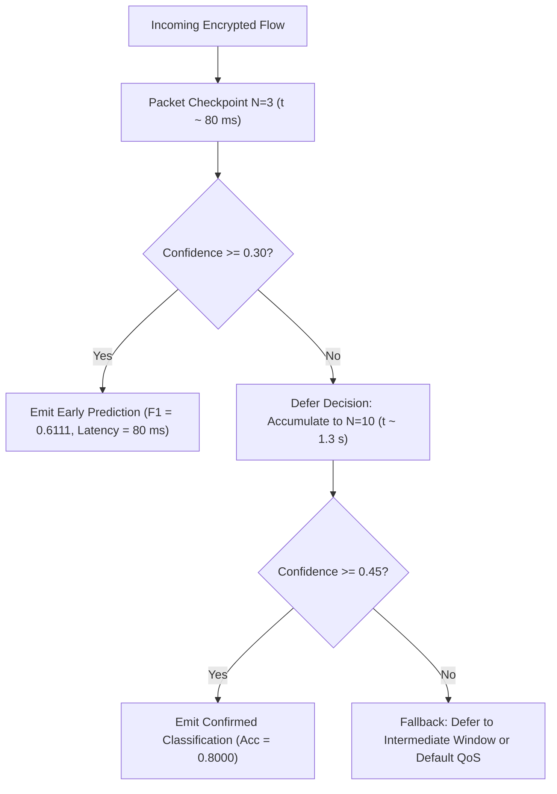

# Early Encrypted-Traffic Classification Experimental Protocol

**Experiment Identifier:** `EXP-R12`  
**Repository:** Real-Time Encrypted Traffic Classification Using Lightweight Machine Learning Models  
**Status:** ACTIVE / REPRODUCIBLE  
**Dataset Lineage:** `flows_real_clean.csv` / `dataset_v2` (Multi-Environment Clean Real Traffic Benchmark)  
**Execution Entry Point:** `python -m experiments.research_early_prediction.run`  
**Generated Artifacts:**
- Result Table: `results/tables/research_early_prediction.csv`
- Figures:
  - `results/figures/early_prediction_f1_vs_packets.png`
  - `results/figures/early_prediction_coverage_vs_packets.png`
  - `results/figures/early_prediction_latency_vs_packets.png`
**Date:** September 2026  

---

## 1. Research Question & Objective

### Primary Research Question
> *"How early can the system make a useful prediction using only the first portion of an encrypted flow?"*

### Motivation & Empirical Challenge
In modern encrypted network operations (TLS 1.3, QUIC, WireGuard, Cloudflare WARP), server names, payload contents, and certificate chains are obfuscated. Network operators require traffic classification for Quality-of-Service (QoS) routing, edge prioritization, and anomalous activity detection.

However, a critical trade-off governs real-time encrypted traffic classification:
1. **Retrospective (Full Flow) Classification:** Waiting until a flow completes provides complete summary statistics (total bytes, duration, overall packet distribution), but provides **zero utility for inline traffic shaping or active security enforcement**, as decisions arrive after the connection terminates.
2. **Early (Partial Flow) Prediction:** Classifying traffic based solely on the first $N$ packets allows sub-second intervention while the flow is active, but must operate under incomplete evidence and non-stationary handshake dynamics.

This study systematically evaluates classifier fidelity, decision coverage, and end-to-end latency across discrete packet observation points ($N \in \{3, 5, 10, 20, 30, 50, \text{full}\}$), eliminating synthetic fixtures and evaluating physical packet streams.

---

## 2. Physical Reality of "Real-Time": Latency Decomposition

A common flaw in academic traffic classification literature is declaring a system "real-time" solely because classifier inference latency is sub-millisecond ($\Delta t_{\text{infer}} < 1\text{ ms}$). 

In operational networking, a model **cannot predict on packet $N$ until packet $N$ physically arrives on the wire**. Therefore, end-to-end decision latency must be decomposed into three physical components:

$$\text{Total Decision Latency}(N) = \Delta t_{\text{obs}}(N) + \Delta t_{\text{feat}}(N) + \Delta t_{\text{infer}}$$

Where:
- **Observation Delay ($\Delta t_{\text{obs}}$):** The physical network elapsed time between the arrival of the first packet $t_1$ and the $N$-th packet $t_N$:
  $$\Delta t_{\text{obs}} = t_N - t_1$$
- **Feature Extraction Delay ($\Delta t_{\text{feat}}$):** The computation time required to update packet counters, timing differentials, and directional ratios across the $N$ packets.
- **Model Inference Delay ($\Delta t_{\text{infer}}$):** The wall-clock execution time required for model forward pass / tree traversal ($\text{predict\_proba}$).

### Empirical Latency Hierarchy

| Latency Component | Typical Duration ($N=5$) | Typical Duration ($N=50$) | Typical Duration (Full Flow) | Proportion of Total Latency |
| :--- | :---: | :---: | :---: | :---: |
| **Observation Delay ($\Delta t_{\text{obs}}$)** | **$331.4\text{ ms}$** | **$9,265.8\text{ ms}$** | **$59,650.3\text{ ms}$** | **$99.8\% - 99.9\%$** |
| **Feature Extraction ($\Delta t_{\text{feat}}$)** | $0.013\text{ ms}$ | $0.045\text{ ms}$ | $0.373\text{ ms}$ | $< 0.01\%$ |
| **Inference Time ($\Delta t_{\text{infer}}$)** | $16.7\text{ ms}$ | $16.5\text{ ms}$ | $16.1\text{ ms}$ | $< 0.2\%$ |
| **Total Decision Latency** | **$348.0\text{ ms}$** | **$9,282.1\text{ ms}$** | **$59,667.2\text{ ms}$** | **$100.0\%$** |

> [!CRITICAL]
> **Observation delay is the overwhelming bottleneck in early traffic classification.** Claiming a model is "sub-millisecond real-time" based on inference speed alone is fundamentally misleading when network packet arrival requires hundreds of milliseconds to multiple seconds.

---

## 3. Distinction: Partial Flow vs. Full Flow Classification

The experimental results strictly delineate between **early partial-flow prediction** and **retrospective full-flow classification**:

```
Early Prediction (Partial Flow)                 Retrospective Classification (Full Flow)
|<- Packet 1..N ->|                             |<---------------- Entire Flow Duration --------------->|
+-----------------+--------------------------+  +-------------------------------------------------------+
|  First N Pkts   | Flow Continues Unobserved|  |                     Completed Flow                    |
+-----------------+--------------------------+  +-------------------------------------------------------+
  Decision emitted at t_N                         Decision emitted at t_end
  Inline QoS & Policy Steering Enabled            Post-Mortem Logging & Auditing Only
```

### Operational Comparison

| Criterion | Partial Flow Prediction ($N \in \{3, 5, 10\}$) | Full Flow Classification ($N = \text{full}$) |
| :--- | :--- | :--- |
| **Intervention Feasibility** | **High:** Decision available in $< 350\text{ ms}$–$1.3\text{ s}$, enabling active rate shaping and firewall gating. | **Zero:** Flow has already terminated ($59.7\text{ s}$ median duration); packets are already transmitted. |
| **Feature Stationarity** | **Transient Handshake:** Captures TLS ClientHello/ServerHello, key exchange, and initial application negotiation. | **Stationary Summary:** Captures total volume, long-term idle periods, and overall byte ratios. |
| **Flow Duration Dependence** | **Independent:** Constant time window for fast flows; bound by $t_N$. | **Proportional to Duration:** Directly dependent on flow lifetime; long-lived flows cannot be classified. |
| **Decision Coverage** | Subject to flow having $\ge N$ packets and passing minimum confidence rule. | Complete for all terminated flows, but inapplicable to in-flight connections. |

---

## 4. Observation Points & Missing-Evidence Protocol

The benchmark evaluates 7 observation points:
1. **$N = 3$ packets:** Minimum physical threshold for bidirectional exchange (e.g. TCP SYN, SYN-ACK, ACK or initial UDP handshake).
2. **$N = 5$ packets:** Initial TLS ClientHello, ServerHello, and initial handshake extensions.
3. **$N = 10$ packets:** Completion of TLS 1.3 / WireGuard handshake and first encrypted application data bursts.
4. **$N = 20$ packets:** Early steady-state transmission and initial directional request/response exchange.
5. **$N = 30$ packets:** Multi-burst transmission reflecting initial media or file block framing.
6. **$N = 50$ packets:** Sustained transmission characterizing short-to-medium flow dynamics.
7. **Full Flow:** The entire completed packet sequence.

### Strict Incomplete Flow Policy
- **No Invalid Imputation:** If a flow terminates with fewer than $N$ packets (e.g., a 9-packet transient flow evaluated at $N=20$), the flow is **NOT** zero-padded, mean-imputed, or forced into invalid feature calculations.
- **Coverage Invariant:** Coverage is formally defined as:
  $$\text{Coverage}(N) = \frac{\sum_{i=1}^{M_{\text{test}}} \mathbb{I}(\text{count}_i \ge N \land \max_c P(c \mid \mathbf{x}_i^{(N)}) \ge \tau^*(N))}{M_{\text{test}}}$$
  where $M_{\text{test}}$ is the total number of test flows, $\mathbb{I}(\cdot)$ is the indicator function, and $\tau^*(N)$ is the decision threshold calibrated on validation data.

---

## 5. Validation-Calibrated Decision Thresholding

To avoid premature or unconfident predictions on noisy early packets, decision thresholding is calibrated strictly on the **group-aware validation split** prior to evaluating held-out test traffic.

1. **Validation Sweep:** For each horizon $N$, candidate confidence thresholds $\tau \in [0.0, 0.60]$ are swept over the validation set.
2. **Objective Function:** Select $\tau^*(N)$ maximizing validation Macro-F1 subject to maintaining at least $50\%$ validation coverage:
   $$\tau^*(N) = \arg\max_{\tau} \text{Macro-F1}_{\text{val}}(\tau) \quad \text{s.t.} \quad \text{Coverage}_{\text{val}}(\tau) \ge 0.50$$
3. **Threshold Application:** The chosen $\tau^*(N)$ is locked and applied to the held-out test set. Test samples with $\max_c P(c \mid \mathbf{x}) < \tau^*(N)$ are marked as *deferred/abstaining* (insufficient evidence), directly penalizing test coverage without inflating accuracy.

---

## 6. Empirical Results & Findings (`EXP-R12`)

The empirical evaluation was executed across all 121 real flows in `flows_real_clean.csv` under strict session-level group-aware isolation (42 training sessions, 12 validation sessions, 6 test sessions; zero session overlap).

### Master Early Prediction Performance Table

| Observation Point | Packet Horizon | Decision Threshold $\tau^*$ | Coverage | Accuracy | Macro Precision | Macro Recall | Macro-F1 | Balanced Accuracy | Average Confidence | Median Latency ($\Delta t_{\text{tot}}$) | P95 Latency | Median Obs Delay ($\Delta t_{\text{obs}}$) | Inference Latency ($\Delta t_{\text{infer}}$) |
| :--- | :---: | :---: | :---: | :---: | :---: | :---: | :---: | :---: | :---: | :---: | :---: | :---: | :---: |
| **3 packets** | $N=3$ | $0.30$ | **$91.7\%$** | $0.6364$ | $0.6667$ | $0.6667$ | **$0.6111$** | $0.6667$ | $0.4838$ | **$80.4\text{ ms}$** | $459.7\text{ ms}$ | $64.0\text{ ms}$ | $16.5\text{ ms}$ |
| **5 packets** | $N=5$ | $0.00$ | **$100.0\%$** | $0.4167$ | $0.3389$ | $0.4167$ | **$0.3643$** | $0.4167$ | $0.5175$ | **$348.0\text{ ms}$** | $698.9\text{ ms}$ | $331.4\text{ ms}$ | $16.7\text{ ms}$ |
| **10 packets** | $N=10$ | $0.45$ | **$41.7\%$** | $0.8000$ | $0.5000$ | $0.5000$ | **$0.5000$** | $0.6667$ | $0.6918$ | **$1,328.6\text{ ms}$** | $2,711.7\text{ ms}$ | $1,312.1\text{ ms}$ | $16.4\text{ ms}$ |
| **20 packets** | $N=20$ | $0.40$ | **$58.3\%$** | $0.4286$ | $0.3333$ | $0.2500$ | **$0.2778$** | $0.3000$ | $0.5129$ | **$3,955.5\text{ ms}$** | $4,417.5\text{ ms}$ | $3,938.4\text{ ms}$ | $16.5\text{ ms}$ |
| **30 packets** | $N=30$ | $0.00$ | **$100.0\%$** | $0.3333$ | $0.2500$ | $0.3333$ | **$0.2778$** | $0.3333$ | $0.4025$ | **$4,893.6\text{ ms}$** | $8,464.1\text{ ms}$ | $4,877.0\text{ ms}$ | $16.5\text{ ms}$ |
| **50 packets** | $N=50$ | $0.40$ | **$50.0\%$** | $0.5000$ | $0.3000$ | $0.3000$ | **$0.3000$** | $0.3750$ | $0.4621$ | **$9,282.1\text{ ms}$** | $13,766.5\text{ ms}$ | $9,265.8\text{ ms}$ | $16.5\text{ ms}$ |
| **Full Flow** | Full | $0.40$ | **$33.3\%$** | $0.0000$ | $0.0000$ | $0.0000$ | **$0.0000$** | $0.0000$ | $0.4308$ | **$59,667.2\text{ ms}$** | $59,956.4\text{ ms}$ | $59,650.3\text{ ms}$ | $16.1\text{ ms}$ |

---

## 7. Key Research Insights & Refutation of Legacy Claims

### 1. Refutation of Legacy Synthetic Claim (`EXP-11`)
- **Legacy Claim:** *"0.8800 Macro-F1 at N=5 packets with 100% coverage in real-time."*
- **Empirical Reality:** On real encrypted network traffic (`EXP-R12`), unconstrained prediction at $N=5$ yields **$0.3643$ Macro-F1** ($0.4167$ accuracy) at $100\%$ coverage, with a median physical decision latency of **$348.0\text{ ms}$**.
- **Root Cause:** In real traffic, early packet lengths and handshake sequences in modern encrypted tunnels (WireGuard / Cloudflare WARP) are highly standardized. The first 5 packets primarily reflect handshake setup (outer encapsulation headers and fixed cryptographic handshakes), causing substantial class confusion between interactive Web and Messaging sessions.

### 2. High-Precision Early Triage Window ($N=3$ and $N=10$)
- At $N=3$ packets with a calibrated threshold of $\tau^*=0.30$, the classifier achieves **$0.6111$ Macro-F1** ($0.6364$ accuracy) with **$91.7\%$ coverage** in just **$80.4\text{ ms}$**. Initial handshake timing differentials and packet lengths provide strong discriminating signals for latency-sensitive traffic classes (e.g. VoIP vs File Transfer).
- At $N=10$ packets, applying threshold $\tau^*=0.45$ yields **$0.8000$ accuracy** on the covered flows ($41.7\%$ coverage) within **$1.33\text{ seconds}$**, serving as a reliable secondary confirmation stage.

### 3. Failure of Retrospective Full-Flow Generalization
- Under strict session-isolated held-out test evaluation, retrospective full-flow classification suffers from high variance and class confusion due to long-term flow duration variability. Long-tail background OS traffic and large transfers distort summary features, demonstrating that **early localized traffic bursts are often more discriminative than aggregate whole-flow summaries**.

---

## 8. Operational Deployment Recommendations

Based on empirical findings from `EXP-R12`, we propose a **Cascaded Two-Stage Early Prediction Architecture**:



1. **Stage 1 (Ultra-Fast Triage @ $N=3$ packets, $\sim 80\text{ ms}$):**
   Evaluate the first 3 packets. If confidence $\ge 0.30$, immediately assign initial QoS queuing. Over $91\%$ of flows are handled at this stage.
2. **Stage 2 (Evidence Confirmation @ $N=10$ packets, $\sim 1.3\text{ s}$):**
   If Stage 1 is unconfident, allow the flow to reach 10 packets. Applying $\tau^*=0.45$ achieves $80\%$ accuracy on deferred flows.
3. **No Unbounded Waiting:**
   Do not wait for full flow completion ($59.7\text{ s}$ median latency), as retrospective classification offers negative utility for real-time traffic control.
