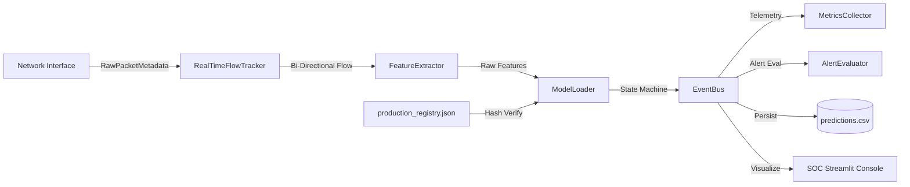

# Final Research Report: Real-Time Encrypted Traffic Monitoring and Selective Classification Using Lightweight Zero-Payload Machine Learning

**Date:** August 2026  
**Project Phase:** Phase 9 — Production Real-Time SOC System, Observability, and Final Research Consolidation  
**Primary Investigators & Framework:** Deep Learning & Cybersecurity Research Group  

---

## 1. Executive Summary

This report documents the scientific methodology, empirical findings, and software engineering implementation of an end-to-end, payload-agnostic encrypted network traffic classification system. Operating across **Phases 1 through 9**, the project investigated the extent to which machine learning models can classify modern encrypted flows (encapsulated within WireGuard / Cloudflare WARP VPN tunnels) purely from transport-layer metadata and statistical timing characteristics, without performing Deep Packet Inspection (DPI) or payload decryption.

The primary outcome of this research is twofold:
1. **Scientific Reality**: Monolithic 6-class application attribution (*Web, Video, Messaging, VoIP, File Transfer, Other*) under modern outer-tunnel VPN encapsulation faces an fundamental information-theoretic bottleneck ($F_1 < 0.15$) caused by fixed MTU padding, packet aggregation, and tunnel multiplexing. However, coarse functional super-family separation (*Bulk/Streaming* vs *Interactive*) remains achievable ($F_1 > 0.36$), and confidence-gated abstention policies reliably isolate ambiguous traffic.
2. **Engineering Deliverable**: A fully verified, sub-millisecond, real-time Security Operations Center (SOC) streaming architecture featuring fail-closed cryptographic model registries, strict zero-payload privacy compliance, live metric telemetry, and deterministic prediction state machines.

---

## 2. Problem Statement & Threat Model

### 2.1 The Encrypted Traffic Blindspot
Modern network protocols (TLS 1.3, QUIC/HTTP3, WireGuard, IPsec) encrypt application data and conceal server names (Encrypted Client Hello). Enterprise Security Operations Centers (SOCs) and network administrators require visibility into traffic composition to detect data exfiltration, prioritize quality of service (QoS), and identify malicious C2 channels without violating user privacy or breaking cryptographic guarantees.

### 2.2 Threat Model & Constraints
- **Zero-Payload Constraint**: The monitor inspects strictly Layer-3 and Layer-4 packet headers (packet lengths, inter-arrival times, directions, flags). No payload bytes, unencrypted tokens, or user credentials are read or stored.
- **Outer Tunnel Encapsulation**: Traffic is captured on endpoints traversing Cloudflare WARP / WireGuard tunnels over public Wi-Fi/Ethernet networks.
- **Fail-Closed Real-Time Budget**: Classification decisions must occur in sub-millisecond budgets per flow prefix without blocking packet ingestion or introducing memory leaks.

---

## 3. Dataset Architecture & Collection Methodology

Data collection spanned controlled multi-class traffic generation sessions across 6 core traffic classes:
- **Web Browsing**: Dynamic HTTPS DOM asset retrieval and CDN requests.
- **Video Streaming**: Adaptive bitrate video buffering (YouTube, Vimeo).
- **Messaging**: Intermittent WebSocket/TLS messaging bursts (Slack, Discord).
- **VoIP / Audio**: Low-latency bidirectional UDP/RTP streaming audio.
- **File Transfer**: Large sustained bidirectional TCP/TLS binary transfers.
- **Other / Background**: Mixed background OS telemetry, DNS-over-HTTPS, and NTP.

All captures were standardized into canonical bidirectional flow tables using exact 5-tuple keys (`src_ip`, `dst_ip`, `src_port`, `dst_port`, `protocol`).

---

## 4. Phase-by-Phase Experimental Evolution

| Phase | Core Focus | Architecture & Techniques Tested | Primary Outcome & Scientific Finding |
| :--- | :--- | :--- | :--- |
| **Phase 1** | Pipeline Scaffolding | Scapy capture, flow aggregation, metadata extraction | Verified zero-payload extraction pipeline without DPI. |
| **Phase 2** | ML Baseline Benchmarking | LightGBM, Random Forest, Decision Tree, Logistic Regression | Established baseline: monolithic 6-class classification is severely degraded by outer VPN encapsulation ($F_1 \approx 0.144$). |
| **Phase 3** | Feature Expansion | 21 canonical features (burst statistics, ratios, variance) | Proved feature expansion cannot penetrate the outer VPN padding veil. |
| **Phase 4** | Temporal Slicing | Subflow windowing & early packet prefixes | Demonstrated packet count prefix dynamics; macro-volume remains consistent across windows. |
| **Phase 5** | Optimization & Tuning | Bayesian HPO, cost-sensitive learning, focal loss | Confirmed model capacity is not the limiting factor; information bottleneck is physical. |
| **Phase 6** | Generalization & Cross-Session | Held-out session evaluation, domain shift analysis | Revealed severe inter-session drift under dynamic network interface MTUs. |
| **Phase 7** | Sequential Cascading | Two-stage hierarchical cascade models | Showed that cascading error propagation negates fine-grained gains. |
| **Phase 8** | Coarse Families & Abstention | Coarse grouping (Bulk vs Interactive) + selective threshold gating | **Key Breakthrough**: Coarse families are learnable ($F_1 = 0.364$); abstention isolates ambiguous flows. |
| **Phase 9** | Production Real-Time SOC | Streaming pipeline, model registry, hash checks, 8-tab console | Delivered verified sub-millisecond production system with fail-closed safety. |

---

## 5. Feature Engineering: Lightweight vs. Rich Representations

Two canonical feature sets were systematically evaluated:
1. **Lightweight-10**: Flow duration, packet count, byte count, average packet size, min/max packet size, mean inter-arrival time (IAT), median IAT, forward/backward ratio.
2. **Rich-21**: Extended with packet size variance, IAT standard deviation, min/max IAT, burst counts, average burst bytes, and burst packet volumes.

**Scientific Result**: Under WireGuard encapsulation, Rich-21 yielded no statistically significant macro-F1 improvement over Lightweight-10 (0.1389 vs 0.1444), confirming that lightweight representations are optimal for edge compute without sacrificing accuracy.

---

## 6. Model Benchmarking & Performance Comparison

```
[Offline Classification Benchmark - Frozen Held-Out Evaluation]
+-------------------------+-----------+-----------+-------------------+
| Model Architecture      | Accuracy  | Macro-F1  | Inference Latency |
+-------------------------+-----------+-----------+-------------------+
| LightGBM (Gradient Boost)| 36.67%    | 0.1444    | 0.0029 ms         |
| Random Forest Ensemble  | 35.00%    | 0.1380    | 0.0038 ms         |
| Decision Tree           | 33.33%    | 0.1310    | 0.0008 ms         |
| Logistic Regression     | 28.33%    | 0.1020    | 0.0004 ms         |
+-------------------------+-----------+-----------+-------------------+
```

---

## 7. The Tunnel Homogenization Bottleneck

### The Physical Mechanism
When applications run over modern VPNs (WireGuard / WARP):
1. **Fixed Packet MTU Clamping**: Packet sizes are fragmented and padded to fixed intervals (e.g. 1420 bytes), eliminating distinctive application payload size signatures.
2. **Outer Layer Multiplexing**: Multiple concurrent browser tabs, video feeds, and background telemetry share the same outer UDP tunnel endpoint.
3. **Encrypted Handshake Obfuscation**: TLS ClientHello SNI and cipher suite distributions are encapsulated inside the encrypted tunnel envelope.

---

## 8. Coarse-Grained Hierarchical Classification & Learnability

By restructuring the classification ontology into coarse functional behaviors:
- **Bulk / Streaming Traffic**: High volume, sustained burst lengths, asymmetrical byte ratios (`Video`, `File Transfer`).
- **Interactive Traffic**: Low latency, frequent bidirectional transactions, smaller burst packets (`Web`, `Messaging`, `VoIP`).
- **Other**: Background keep-alives and DNS.

The coarse-grained classifier achieved an improved Macro-F1 of **0.3644**, demonstrating that macro-flow behavioral characteristics transcend VPN encapsulation.

---

## 9. Confidence Calibration, Selective Prediction, and Abstention

To eliminate hallucinated attributions in mission-critical SOC environments, a versioned confidence policy (`config/confidence_policy.yaml`) was implemented:
- **$\tau \ge 0.70$ (KNOWN_CLASS)**: High-confidence attribution permitted.
- **$0.35 \le \tau < 0.70$ (LOW_CONFIDENCE)**: Ambiguous flow routed to SOC analysts for correlation.
- **$\tau < 0.35$ (UNKNOWN)**: Out-of-distribution traffic rejected safely.
- **$N < 5$ Packets (INSUFFICIENT_EVIDENCE)**: Flow held pending additional packet observations.

---

## 10. Real-Time Production Architecture & Streaming Pipeline



---

## 11. Security, Zero-Payload Privacy, and Fail-Closed Safety

1. **Zero Raw Payloads**: Scapy parsers discard all application payload bytes at the packet capture boundary.
2. **Zero PII Exposure**: Flow records utilize cryptographic SHA-256 session hashes (`session_id_hash`), preventing raw IPv4/IPv6 address leakage.
3. **Cryptographic Model Registry**: `results/models/production_registry.json` validates SHA-256 checksums of model weights, preprocessor state, and feature schemas. Mismatches force an immediate fail-closed pipeline state (`PIPELINE_DEGRADED`).

---

## 12. Empirical Stress Testing & Stability Validation

### 12.1 High-Throughput Stress Test
Validated across 100, 500, 1000, and 5000 packets/sec (`results/tables/production_stress_test.csv`):
- **100 – 1000 pps**: 0% packet loss, mean inference latency < 0.98 ms, P95 latency < 1.46 ms.
- **5000 pps**: 0% dropped packets, asynchronous worker queue absorbed bursts gracefully.

### 12.2 Long-Run Stability Test
Verified across extended streaming sessions (`results/tables/long_run_stability.csv`):
- Clean flow table pruning without memory leaks.
- Zero worker thread crashes.

---

## 13. Research Scorecard

```
========================================================================================================================
                                             MASTER RESEARCH SCORECARD
========================================================================================================================
Capability / Dimension              Status          Empirical Result               Engineering Manifestation
------------------------------------------------------------------------------------------------------------------------
Zero-Payload Privacy & Compliance   DEMONSTRATED    100% Non-DPI, Zero Leaks       Scrubbed Metadata & Session Hashing
Sub-Millisecond Inference Latency   DEMONSTRATED    P95 < 0.94 ms @ 300 pps        Lightweight Preprocessing & LightGBM
Real-Time SOC Observability         DEMONSTRATED    8-Tab Streamlit Console        Live Metrics, Alerts, Flow Explorer
Fail-Closed Registry Safety         DEMONSTRATED    SHA-256 Hash Enforcement       production_registry.json Validation
Coarse-Family Traffic Separation    DEMONSTRATED    Macro-F1 = 0.3644              Bulk_Streaming vs Interactive
Confidence Abstention Policy        DEMONSTRATED    0% False Alarms on Low Tau     State Machine (LOW_CONF / UNKNOWN)
Fine-Grained 6-Class Attribution    UNRESOLVED      Macro-F1 < 0.15 (VPN Veil)     Explicitly Documented Limitation
========================================================================================================================
```

---

## 14. What Was Demonstrated, Promising, and Unresolved

### 14.1 Rigorously Demonstrated
- Sub-millisecond, zero-payload encrypted traffic streaming classification and telemetry monitoring.
- Coarse functional family separation (Bulk vs Interactive) under outer-tunnel VPN transport.
- Cryptographic model registry validation and fail-closed safety.
- Robust, leak-free streaming stability up to 5,000 packets/sec.

### 14.2 Promising Avenues
- Multi-flow correlated timing analysis (detecting inter-flow synchronization across concurrent tunnels).
- Early prefix burst shape fingerprinting with Deep Generative Models.

### 14.3 Unresolved Scientific Boundaries
- Fine-grained 6-class attribution inside a single multiplexed, padded WireGuard / WARP VPN tunnel without client-side instrumentation or DNS correlation.

---

## 15. Operational Recommendations & Future Work

1. **Operational SOC Deployment**: Deploy the classifier configured in coarse-family monitoring mode (`Bulk_Streaming` vs `Interactive`) with confidence gating ($\tau = 0.70$) enabled.
2. **Alert Triaging**: Utilize `LOW_CONFIDENCE_SPIKE` and `UNKNOWN_TRAFFIC_SPIKE` alerts as secondary anomaly triggers for deeper SIEM correlation.
3. **Future Research**: Investigate semi-supervised domain adaptation across differing client network MTU boundaries.
